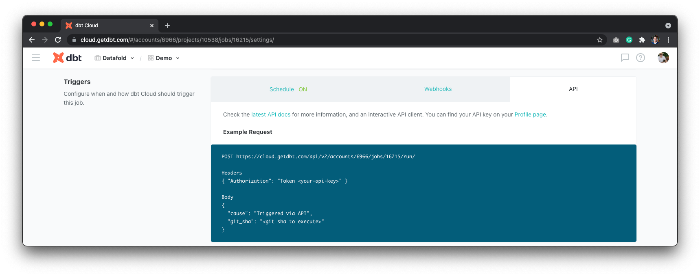
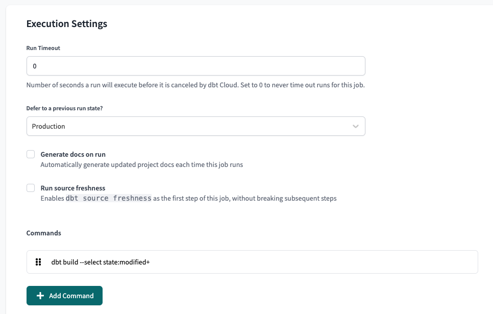

* [Prerequisites](dbt_cloud.md#prerequisites)
* [Basic Config](dbt_cloud.md#basic-config)
    * [Scheduled Production Job](dbt_cloud.md#scheduled-production-job)
    * [Merge Trigger Production Job](dbt_cloud.md#merge-trigger-production-job)
    * [Pull Request Job](dbt_cloud.md#pull-request-job)
* [Datafold Config](dbt_cloud.md#datafold-config)
* [Advanced Config](dbt_cloud.md#advanced-config)
    * [Pull Request Job](dbt_cloud.md#advanced-pull-request-job)

## Prerequisites
- To access the dbt API Datafold requires a dbt **Team** account or higher.
- You will need either a [Service Token](https://docs.getdbt.com/docs/dbt-cloud-apis/service-tokens) or a [User Token](https://docs.getdbt.com/docs/dbt-cloud-apis/user-tokens):
    - **Service Token (Recommended):** 
        - Navigate to **Account Settings -> Service Tokens -> + New Token**
            - Add a Token Name
            - Add a Permission Set
                - Permission Set: Member
                - Project: All Projects, or check only the projects to use with Datafold
                - Save <br/>
                 <br/>
    - **User Token:**
        - Navigate to **Your Profile -> API Access**
            - Copy

## Basic Config

### Scheduled Production Job

Create a scheduled job (e.g. every 24 hours) in dbt cloud
* **Why?**
    * To refresh models every night
    * Table models should be rematerialized with fresh data


* Navigate to Jobs > Settings > Execution Settings
* Under Commands, add a `dbt build` command:


* Navigate to Jobs > Settings > Triggers > Schedule
* Select "Run on schedule"
* Complete the scheduling form for your desired schedule:


### Merge Trigger Production Job
Create a job that triggers a dbt Cloud production run when changes are pushed to main
* **Why?**
    * To deploy new changes from pull requests immediately
    * This will keep production up to date and enable accurate Datafold diffs
    * By default, dbt Cloud runs the production job on a schedule, not on merges


Example [Github Action](dbt_core/github_actions.md):
```yml
name: Trigger dbt Cloud

on:
  push:
    branches:
      - main

jobs:
  run:
    runs-on: ubuntu-20.04
    timeout-minutes: 15

    steps:
      - name: checkout
        uses: actions/checkout@v2

      - name: Trigger dbt Cloud job
        run: |
          output=$(curl -X POST --fail \
            --header "Authorization: Token ${DBT_API_KEY}" \
            --header "Content-Type: application/json" \
            --data '{"cause": "Commit '"${GIT_SHA}"'"}' \
            https://cloud.getdbt.com/api/v2/accounts/${ACCOUNT_ID}/jobs/${JOB_ID}/run/)

          echo "Triggered dbt Cloud run at:"
          echo ${output} | jq -r .data.href
        env:
          DBT_API_KEY: ${{ secrets.DBT_API_KEY }}
          ACCOUNT_ID: 1234 # dbt account id
          JOB_ID: 4567 # dbt job id of the production tables
          GIT_SHA: "${{ github.ref == 'refs/heads/master' && github.sha || github.event.pull_request.head.sha }}"
```
You need to add the dbt Cloud API key as a secret in GitHub Actions, and you need to set the IDs of the account and the job id that builds the production job. You can find these easily in the dbt Cloud UI:



### Pull Request Job
Create a job that runs when pull requests are opened
* **Why?**
    * To run and test pull request changes before deploying to production
    * Changes are deployed to a test environment during review


* Navigate to Jobs > Settings > Execution Settings
* Under Commands, add a `dbt build` command:


* Navigate to Jobs > Settings > Triggers > Webhooks
* Check "Run on Pull Requests?"


## Datafold Config

See [dbt Cloud Integration](/integrations/orchestration/dbt_cloud.md)

## Advanced Config

### Advanced Pull Request Job
This is similar to the [pull request job](dbt_cloud.md#pull-request-job) above, with some added features:
* [Slim CI](https://docs.getdbt.com/docs/dbt-cloud/using-dbt-cloud/cloud-enabling-continuous-integration#configuring-a-dbt-cloud-ci-job)
    * Speeds up CI by running only your changes
    * Quick primer on [state:modified](https://docs.getdbt.com/reference/node-selection/methods#the-state-method) syntax:
        * `state:modified+` run the modified model(s) and all downstream models
        * `state:+modified` run the modified model(s) and all upstream models
        * `state:modified+n` run the modified model(s) and N downstream models


* Navigate to Jobs > Settings > Execution Settings
* Under "Defer to a previous run state?", select the production job
    * This may or may not be labelled "Production" it is based on the name you chose when creating the job
* Alter the command, adding `--select state:modified+`



