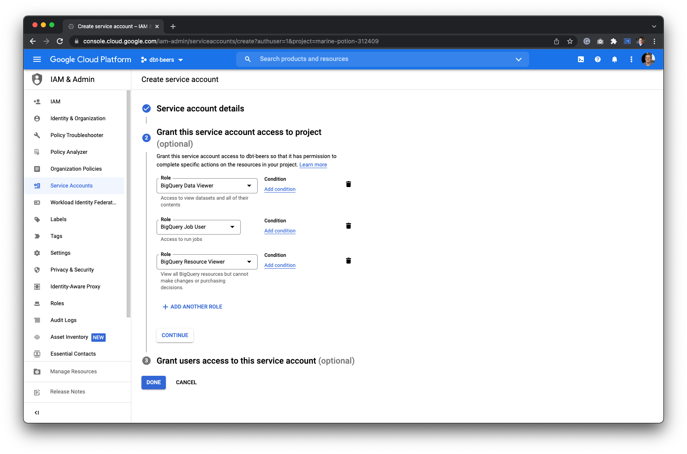
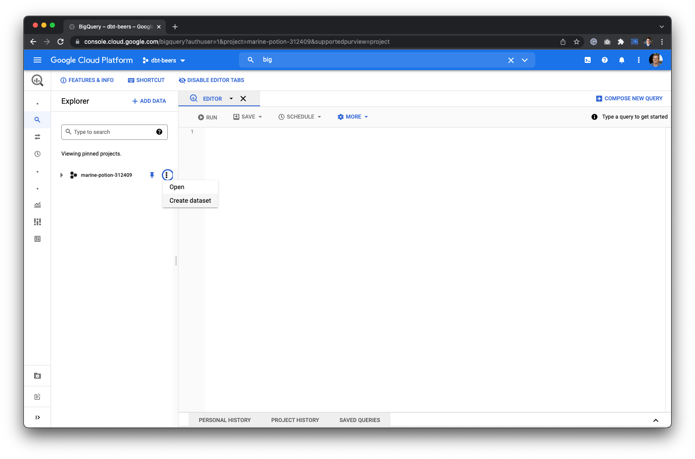
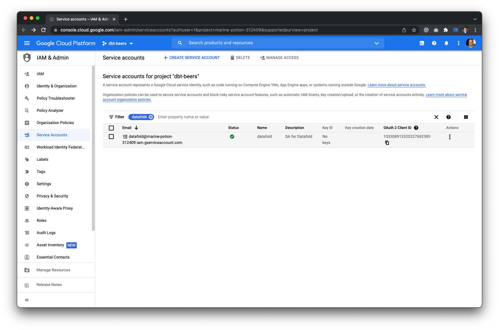

# BigQuery

**Steps to complete:**

* [Create a Service Account](bigquery.md#create-a-service-account)
* [Give the Service Account BigQuery Data Viewer, BigQuery Job User, BigQuery Resource Viewer access](bigquery.md#service-account-access-and-permissions)
* [Create a temporary dataset and give BiqQuery Data Editor access to the service account](bigquery.md#create-a-temporary-dataset)
* [Generate a Service Account JSON key](bigquery.md#generate-a-service-account-key)
* [Configure your data source in Datafold](bigquery.md#configure-in-datafold)

### Create a Service Account

To connect Datafold to your BigQuery project, you will need to create a _service account_ for Datafold to use.

* Navigate to the [Google Developers Console](https://console.developers.google.com/). Before proceeding, click on the drop-down to the left of the search bar and select the project you want to connect to.
* If you do not see the project, you would like to connect to listed in the drop-down, click on the account switcher in the upper right corner of the window and ensure you are logged in to a Google account that is a member of the project.
* Click on the hamburger menu in the upper left and select **IAM & Admin,** and then **Service Accounts**.
* Create the service account and name it `Datafold`

### Service Account Access and Permissions

The Datafold service account requires the following roles and permissions:
- **BigQuery Data Viewer** for read access on all the datasets in the project. 
- **BigQuery Job User** to run queries. 
- **BigQuery Resource Viewer** for fetching the query logs to parse lineage.

### Create a Temporary Dataset

Datafold utilizes a temporary dataset to materialize data between the datasets. By materializing this data in BigQuery we reduce the volume of data that are being processed in Datafold itself. 

:::caution
Make sure that the dataset lives in the same region as the rest of the data, otherwise, the dataset will not be found.
:::

Let's navigate to BigQuery in the console and create a new dataset.

- Give the dataset a name that is related to Datafold, in the example we call it `datafold_tmp`.

- Datafold requires the **BigQuery Data Editor** role on the newly created dataset. Now we're set with the permissions.

### Generate a Service Account Key

Next, we have to go back to the **IAM & Admin** page to generate a key for Datafold:

We recommend using the json formatted key. After creating the key, it will be saved on your local machine.

### Configure in Datafold
| Field Name      | Description |
| ----------- | ----------- |
| Name     | A name given to the data source within Datafold |
| Project ID   | Your BigQuery project ID. It can be found in the URL of your Google Developers Console: `https://console.developers.google.com/apis/library?project=MY_PROJECT_ID`  |
| JSON Key File   | They key file generated in the [Generate a Service Account JSON key](bigquery.md#generate-a-service-account-key) step  |
| Schema for temporary tables     | The schema name that we created formatted as <project_id>.datafold_tmp |
| Processing Location    | Which processing zone your project uses|

Click **Create**. Your data source is ready!