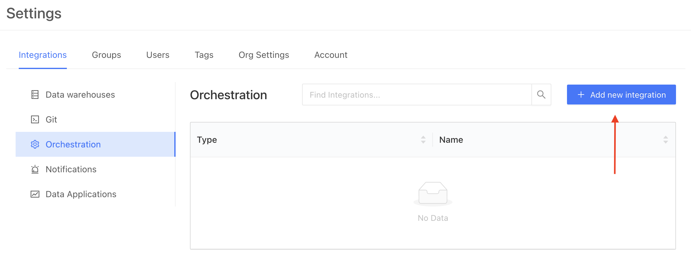

# dbt Core

### Prerequisites
- To configure dbt Core you must first connect a [Data Source](integrations/data_warehouses/dw_overview.md) and connect a [GitHub](/docs/integrations/git/github.md) or [GitLab](/docs/integrations/git/gitlab.md) account.

### Connecting dbt Core

* To set up dbt Core begin by navigating to **Admin** -> **Settings** -> **Orchestration**. Here you will click on **Add New Integration** to enter your dbt Core details. 

### Configure dbt Core on Datafold
After selecting dbt Core from the available options, complete configuration with the following information:

Complete the configuration by specifying the following fields:

| Field Name      | Description |
| ----------- | ----------- |
| Repository | Select the repository that generates the webhooks and where pull / merge requests will be raised. |
| Data Source | Select the data source where the code that is changed in the repository will run.|
| Name | An identifier used in Datafold to identify this CI configuration |
| Primary key tag | See [dbt Integration](./) |
| Sync metadata on every push to production | When selected, will sync the metadata from the dbt run with Datafold every time a push happens on the default branch.|
| Files to ignore | If defined, the files matching the pattern will be ignored in the PRs. The pattern uses the syntax of .gitignore. Excluded files can be re-included by using the negation; re-included files can be later re-excluded again to narrow down the filter. For example, to exclude everything except the `/dbt` folder, but not the dbt `.md` files, do:`*!dbt/*dbt/*.md`|
| Mark the CI check as failed on errors | If the checkbox is disabled, the errors in the CI runs will be reported back to GitHub/GitLab as successes, to keep the check "green" and not block the PR/MR. By default (enabled), the errors are reported as failures and may prevent PR/MRs from being merged. |
| Require the `datafold` label to start CI | When this is selected, the Datafold CI process will only run when the 'datafold' label has been applied. This label needs to be created manually in GitHub or GitLab and the title or name must match 'datafold' exactly. |
| Sampling tolerance | The tolerance to apply in sampling for all data diffs |
| Sampling confidence | The confidence to apply when sampling |
| Sampling Threshold | Sampling will be disabled automatically if tables are smaller than specified threshold. If unspecified, default values will be used depending on the Data Source type. |

:::info

Using dbt Core requires use of the Datafold SDK. Continue with setup by visiting [datafold-sdk](datafold-sdk.md).

:::

### Helpful Guides for dbt Core
* [CI Overview](/guides/ci_guides_overview.md)
* [dbt Core](/guides/ci_guides/dbt_core.md)
* [CircleCI](/guides/ci_guides/dbt_core/circleci.md)
* [Github Actions](/guides/ci_guides/dbt_core/github_actions.md)
* [Gitlab CI](/guides/ci_guides/dbt_core/gitlab_ci.md)